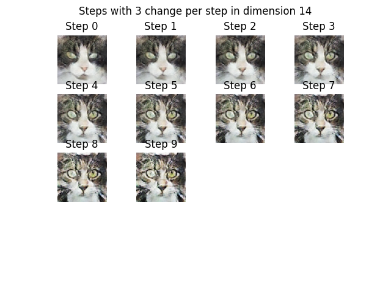
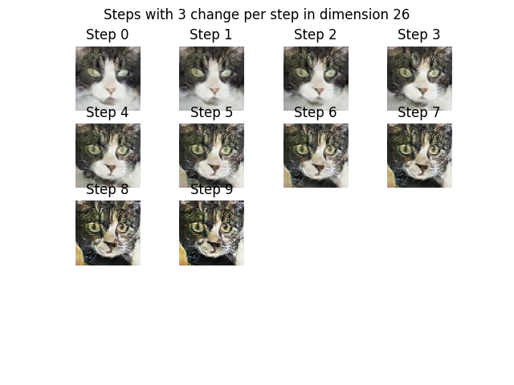

## Unsupervised Representation Learning With Deep Convolutional Generative Adversarial Neural Networks

### Overview

A 2016 paper describing a new class of CNNs with the previous success of CNNs up to that point [1].
The purpose is to learn reusable feature representation from large *unlabeled* datasets. Employs both discriminator and generator like in other GANs.
Previous work on reusable feature representation is what they call the "classic approach" which uses clustering on data (K-Means).
CNN black-box criticism is acknowledged since the authors find it difficult to visualize their inner workings for interpretability.

At this time researchers were having trouble scaling up GANs stably, and the previous year LAPGAN was developed to upscale low-resolution generated images.
Researchers of this paper employed the following:
 1. The convolutional net replaces max-pooling with strided convolutions, which is only in the generator
 2. Eliminating fully connected layers which are usually found at the top of convolutions
 3. Batch Normalization to stabilize learning ($\mu = 0$ and $\sigma = 1$)

The paper employs DCGAN was trained on 3 datasets, I assume 3 separate models with 3 distinct parameters: LSUN, Imagenet-1k, and a Faces dataset.
The datasets are used in the paper, but for this repository's purpose, I used the [catfaces](https://www.kaggle.com/datasets/spandan2/cats-faces-64x64-for-generative-models) dataset.
This one was used since we have no labels and a large amount of data, close to 16k 64x64 images.

### Implementation Details

- Programming Language: Python
- Deep Learning Framework: PyTorch
- Datasets: [CatFaces](https://www.kaggle.com/datasets/spandan2/cats-faces-64x64-for-generative-models)
- Key Modifications: None

### Results

All in all, compared to the diffusion models used today, this was a very simple network that I trained on my own laptop's NVIDIA GeForce RTX 3050 Ti Laptop GPU. The results from the  model are better than I expected them to be
after I followed the paper's specifications on the model exactly.


The paper employs the use of traversing a dimension and seeing how it changes the model's output. I assumed that they modified the dimension by adding/subtracting so that's what I did in the inference notebook. In initial testing I found
that larger numbers mean we can use fewer steps to see how this dimension changes the outputs. This idea was from the section titled "Walking the Latent Space" [1].


Sometimes walking the latent space resulted in a different cat slowly being created until convergence.


Other times a dimension would modify features into strange blobs, in this case, the eyes.






I do have a small concern that the model may have memorized some of the outputs since that is a concern in the initial paper, but given that these aren't perfect and there are about 16k examples this may not be the case.
Overall, this is a different dataset than the paper, but the architecture still proves effective in generating an object (cat face in this case) given a set of random numbers. We can go to the conclusion section and see that generated human faces
aren't perfect, so I think that it's safe to say this is a good representation of the dataset it was trained on [1]. It looks like there are poses in the initial human face dataset the paper was trained on, and there are different turns allowing there
to be a turn space that is walked along. I haven't found a specific pose yet, but above I've shown that we can walk along the latent space regardless to "walk" into a different image.


### Usage

Usage can be found at the end of `train.py` with the .pth file. All that's needed from this folder is `dcmodels.py` and `DCGAN.pth`.
All that needs to be done is load the generator into a variable using the same parameters as before and load the checkpoint from the .pth into the model.
Then the model needs to be set to evaluation to avoid making a computational graph since we are not training anymore! We also need to load the .pth dictionary
into the GPU since we don't need the GPU anymore, this is a small model creating small images:
```
CHANNEL_IMG = 3 
Z_DIM = 100
FEATURES_GEN = 64

checkpoint = torch.load("DCGAN.pth", map_location=torch.device('cpu'))

gen = Generator(Z_DIM, FEATURES_GEN, CHANNEL_IMG)
gen.load_state_dict(checkpoint["gen_state_dict"])
gen.eval();
```

A random image function was created to create a single random noise tensor, but remember to create a random noise tensor from a random uniform distribution: 
```
# random noise
noise = torch.randn(1, 100, 1, 1)

def show_random_noise(generator, random_noise):
  img = torch.squeeze(gen(noise))
  img = (img - img.min()) / (img.max() - img.min())
  img = img * 255
  img = img.int()
  plt.imshow(img.permute(1, 2, 0).detach().numpy())
  plt.axis("off")
```

The rest of these functions and among other things can be found in the [inference notebook](inference.ipynb)

[1] A. Radford, L. Metz, and S. Chintala, “Unsupervised Representation Learning with Deep Convolutional Generative Adversarial Networks,” arXiv.org, 2015. https://arxiv.org/abs/1511.06434
‌
